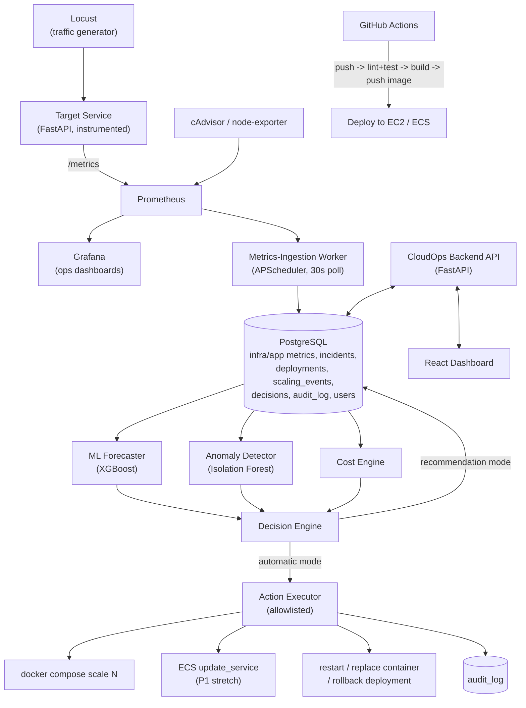

# System Architecture

## Module Responsibilities (summary — full detail in `module-boundaries.md`)

- **target-service** — the monitored application; exposes business endpoints + `/metrics`
- **cloudops-backend** — control plane: API, DB access, ML inference, decision engine, action executor
- **ml** — offline training pipeline; produces serialized models consumed by cloudops-backend
- **dashboard** — React frontend, talks only to cloudops-backend's API
- **infra** — Docker Compose, Prometheus/Grafana config, deployment scripts
