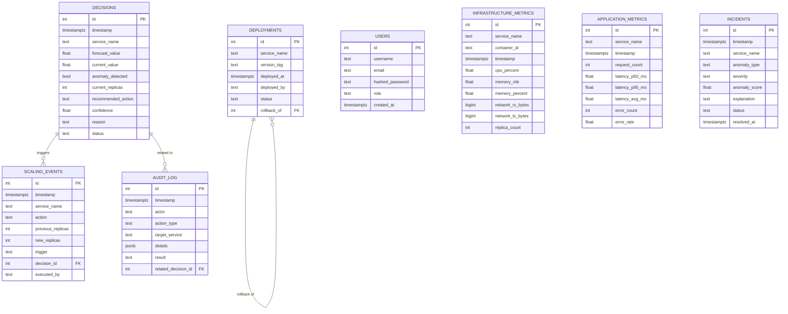

# Database Schema v1

## Entity-Relationship Diagram

## Table Purpose (one line each)
- **users** — auth + role for RBAC (P0: role column exists; enforcement is P1)
- **infrastructure_metrics** — container/host-level data from cAdvisor/node-exporter
- **application_metrics** — request rate/latency/error-rate from target-service
- **decisions** — every decision-engine cycle output, not just executed ones (needed to evaluate confidence calibration later)
- **incidents** — anomaly detector output, one row per detected anomaly
- **deployments** — CI/CD deploy history, self-referencing for rollback tracking
- **scaling_events** — only *executed* scaling actions (subset of decisions with status=executed)
- **audit_log** — every automated/manual action, source of truth for accountability
